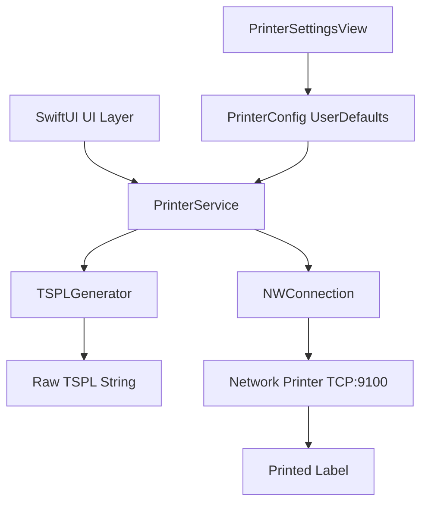
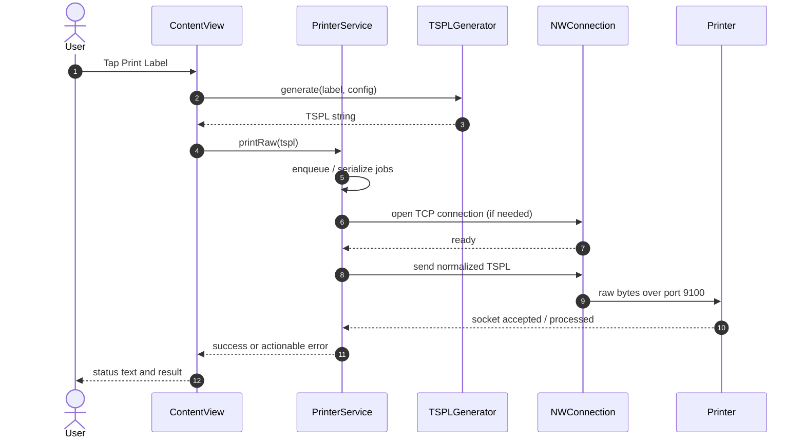

# Architecture Guide

This document explains the print pipeline, the logic behind it, and why it is built this way for production reliability.

## Design Goals

- One tap to print from app UI
- No system print dialog in direct mode
- Explicit, observable connection state
- Stable output across iPhone and iPad
- Easy to transplant into another app

## High-Level Components

- `ContentView.swift`: user interaction and print trigger
- `PrinterService.swift`: connection lifecycle, queueing, send logic, state updates
- `TSPLGenerator.swift`: converts app data to printer language
- `LabelData.swift`: print payload model
- `PrinterSettingsView.swift`: printer config and diagnostics

## Component Diagram

## Sequence: One-Tap Direct Print

## State Model

`PrinterConnectionState` tracks visible app state:
- `disconnected`
- `connecting`
- `connected`
- `printing`
- `error(String)`

This gives clear UX rules:
- Disable print button while `connecting` or `printing`
- Show stage text while printing
- Keep last error visible instead of failing silently

## Why Queueing Matters

`PrinterService` serializes print jobs to avoid overlapping socket writes. Without this, many thermal printers behave unpredictably (queued jobs, partial labels, or dropped commands).

Queue behavior:
- If a job is in progress, new jobs are appended to `pendingPrints`
- Completion triggers the next job automatically
- One active job at a time

## Why Command Normalization Matters

Before sending, commands are normalized to printer-friendly line endings. In practice, this avoids "connected but no output" behavior on some firmware/network combinations.

## Networking Constraints

Direct TCP printing requires:
- App and printer on same network
- Printer reachable at configured IP
- Raw socket port enabled (commonly `9100`)
- iOS local network permission granted

Required `Info.plist` keys:
- `NSLocalNetworkUsageDescription`
- `NSBonjourServices` (for discovery compatibility)

## Logic Summary

1. Build deterministic command payload
2. Send to deterministic destination (`ip:port`)
3. Observe deterministic state transitions
4. Surface deterministic errors

That is the core logic that keeps printing reliable in production.
