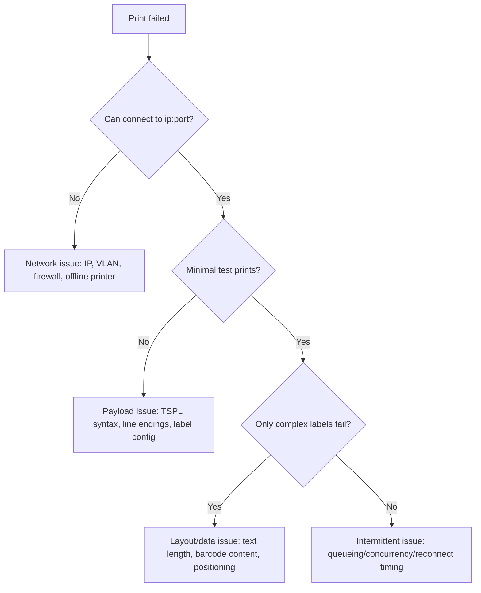

# Troubleshooting Guide

Use this when printing fails, hangs, or behaves inconsistently.

## 60-Second Triage

1. Confirm printer IP and port (`9100`).
2. Confirm phone/iPad and printer are on same network.
3. Confirm local network permission is granted.
4. Send **minimal test label** first.
5. Check debug logs for connection state transitions.

## Symptom Matrix

| Symptom | Likely Cause | What To Do |
|---|---|---|
| Connected, but nothing prints | Printer command format mismatch or line ending issue | Validate TSPL payload and use normalized line endings |
| Connection timeout | IP wrong, network isolated, printer offline | Ping/test from laptop on same Wi-Fi, verify printer IP reservation |
| Connection refused | Printer does not expose raw 9100 | Enable raw socket mode or use fallback path |
| First print works, next prints stall | Multiple jobs sent concurrently | Keep strict single-job queueing |
| Output clipped or scaled wrong | Label size in app and printer media mismatch | Match dimensions in app settings and printer config |
| Barcode unreadable | Low print darkness/speed or tiny dimensions | Increase module width, adjust printer settings |
| Works on simulator, fails on iPad | Local network permission denied on device | Re-enable permission in iOS Settings for app |
| Random failure after Wi-Fi switch | Stale IP or changed subnet | Re-resolve printer IP and reconnect |
| App appears idle during print | No state surfaced to UI | Bind UI to `PrinterConnectionState` and stage text |
| Silent failures | Errors swallowed in callbacks | Always publish failure message to user and logs |

## Deep Diagnosis Flow



## Validate Printer Reachability Outside App

From a machine on same network:

```bash
nc -vz <printer_ip> 9100
```

If this fails, app-level changes will not fix printing.

## Validate Payload with Virtual Printer

Run local sink:

```bash
python3 /Users/geek/MY OWN PROJECTs/test_print/scripts/virtual_printer.py
```

Then print from app and inspect emitted TSPL. Confirm:
- `SIZE` matches expected media
- `GAP`/`DIRECTION`/`CLS` present
- `PRINT 1` present
- No malformed quote escaping

## Device-Specific Checks (iPad/iPhone)

- iOS Settings > app > Local Network = enabled
- Disable VPN/proxy for test run
- Avoid captive guest Wi-Fi networks
- Keep screen awake for long print stress tests

## Logging Strategy

Capture for each failed job:
- Device model + iOS version
- Printer model + firmware
- Printer IP/port
- Full connection state transitions
- First 20 lines of payload (sanitized)
- Exact user-visible error text

Good logs usually remove guesswork and cut debug time significantly.
